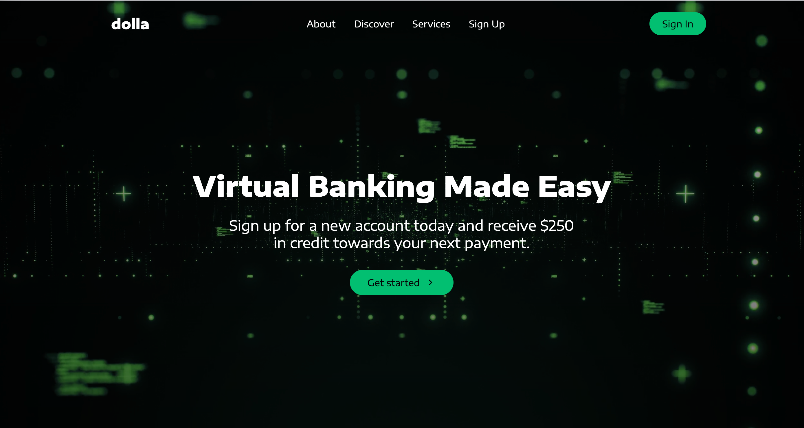

# Dolla Responsive React App

A modern, fully responsive React web application designed to provide an example to a virtual banking experience. Built with React 18, React Router v6, and styled-components for a clean, scalable, and interactive UI.

## ⚙️ Key Features
- **Responsive Design**: The application is built to be fully responsive, ensuring a seamless user experience across various devices.
- **React 18**: Utilizes React 18 for building the user interface.
- **React Router v6**: Implements React Router v6 for efficient routing and navigation.
- **Styled Components**: Uses Styled Components for styling, promoting modular and reusable CSS.
- **Smooth Scrolling**: Incorporates smooth scrolling for enhanced user interaction.
- **React Icons**: Utilizes React Icons for scalable vector icons.
- **React Scroll**: Implements React Scroll for scroll-based navigation.

## Usage

In the project directory, run:

### `yarn install`

To install all necessary dependencies. Then:

### `yarn start`

This runs the app in the development mode.\
Open [http://localhost:3000](http://localhost:3000) to view it in the browser.

The page will reload if you make edits.\
You will also see any lint errors in the console.

## Learn More

You can learn more in the [Create React App documentation](https://facebook.github.io/create-react-app/docs/getting-started).

To learn React, check out the [React documentation](https://reactjs.org/).
